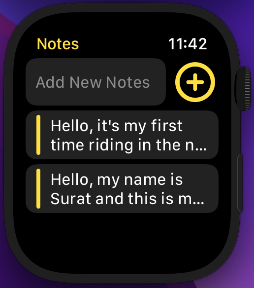
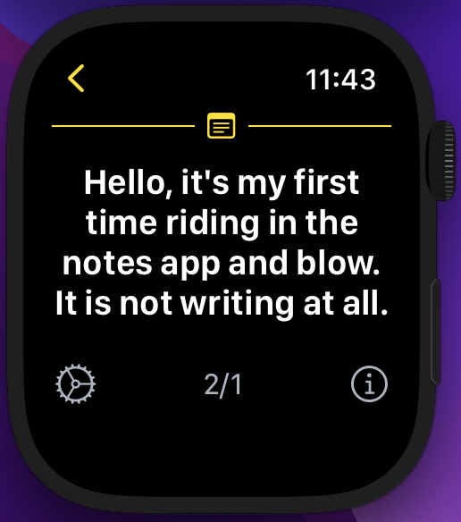
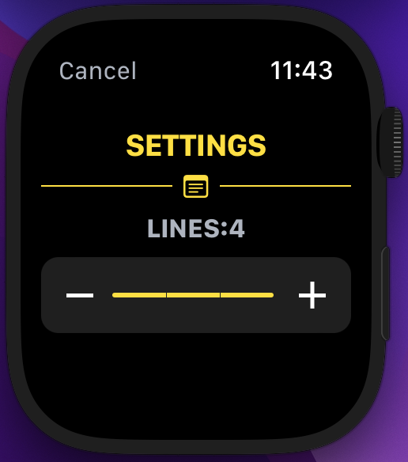

# ⌚ Notes Watch App

A simple yet powerful **Apple Watch Notes App** built with **SwiftUI**.  
Easily create, view, and manage notes directly from your wrist. Designed for minimal UI, fast access, and clean user experience.

---

## ✨ Features

- 📝 **Add Notes**  
  Quickly jot down new notes using the watch keyboard, dictation, or emoji input.

- 📋 **Notes List**  
  View all saved notes in a clean list format with customizable preview line limits.

- 🔍 **Detail View**  
  Expand any note to read its full content in a scrollable view.

- ⚙️ **Settings**  
  Adjust the number of preview lines (1–4) for better readability.

- 👨‍💻 **Credits**  
  Profile page with developer information.

- 💾 **Persistent Storage**  
  Notes are saved locally on the watch using `FileManager` + `JSONEncoder`.

---

## 📸 Screenshots

| Notes List | Add Note | Detail View | Credits | Settings |
|------------|----------|-------------|---------|----------|
|  |  |  |  |  |

---

## 🛠️ Tech Stack

- **Language:** Swift  
- **Framework:** SwiftUI  
- **Platform:** watchOS  
- **Storage:** FileManager + JSONEncoder / JSONDecoder  
- **State Management:** `@State`, `@AppStorage`  

---

## 📂 Project Structure

- `ContentView.swift` → Notes list & input field  
- `DetailView.swift` → Full note display with settings/credits  
- `SettingsView.swift` → Customize note preview lines  
- `CreditsView.swift` → Developer profile  
- `HeaderView.swift` → Reusable header component  

---

## 🚀 Getting Started

1. Clone the repository  
   ```bash
   git clone https://github.com/yourusername/Notes-Watch-App.git
2. Open in Xcode
   ```bash
   open Notes\ Watch\ App.xcodeproj
3. Select an Apple Watch simulator (or real device).
4. Run the project 🎉

---
👤 Credits


**Developer:** Virat Gupta\
Built with ❤️ using SwiftUI.
